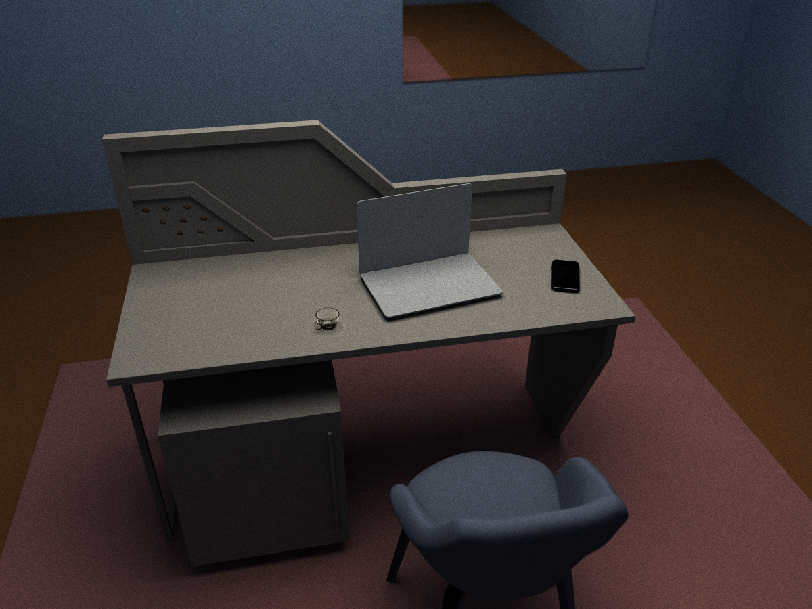
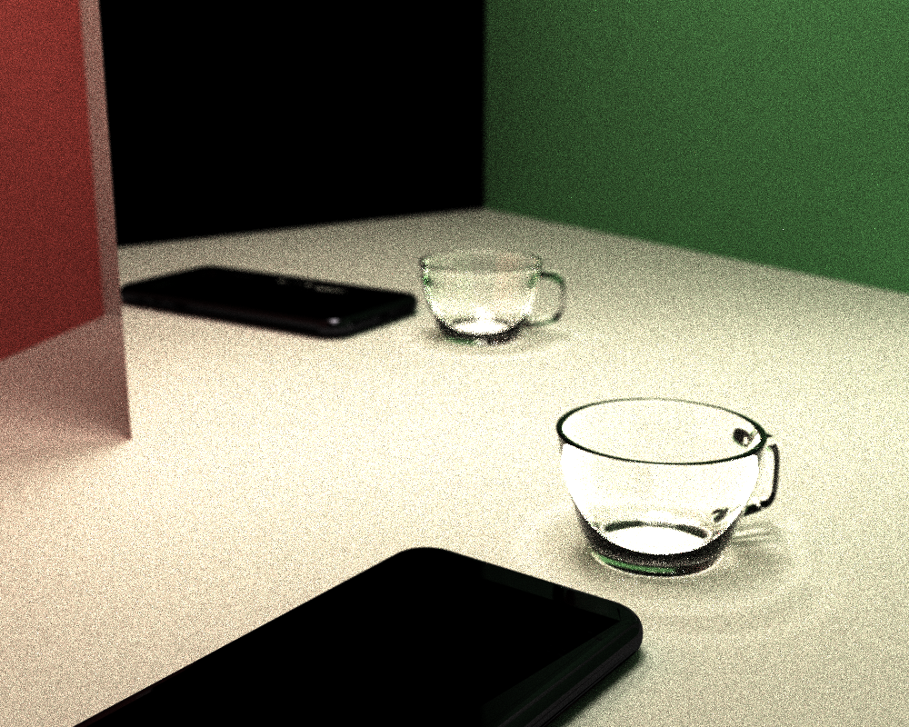
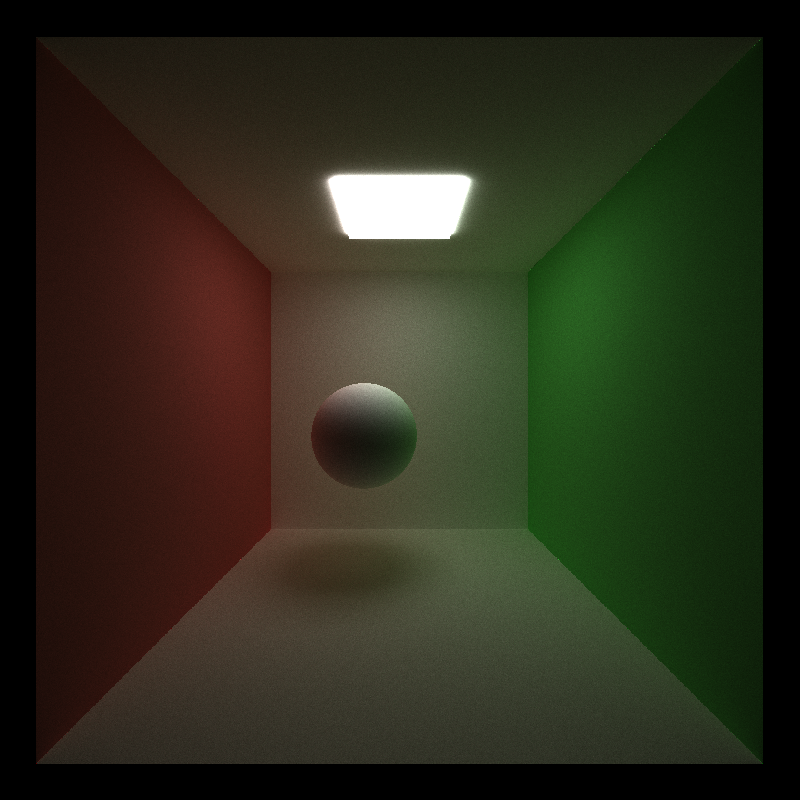
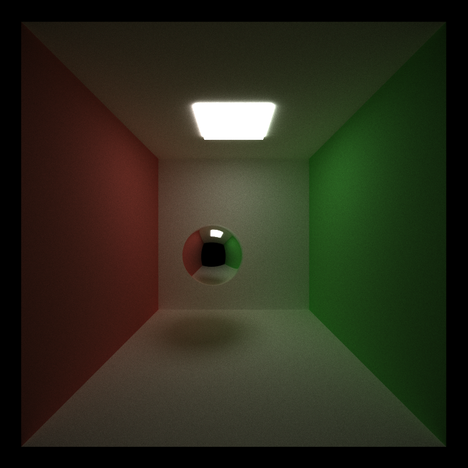
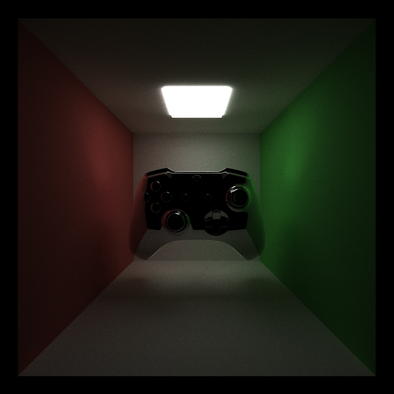
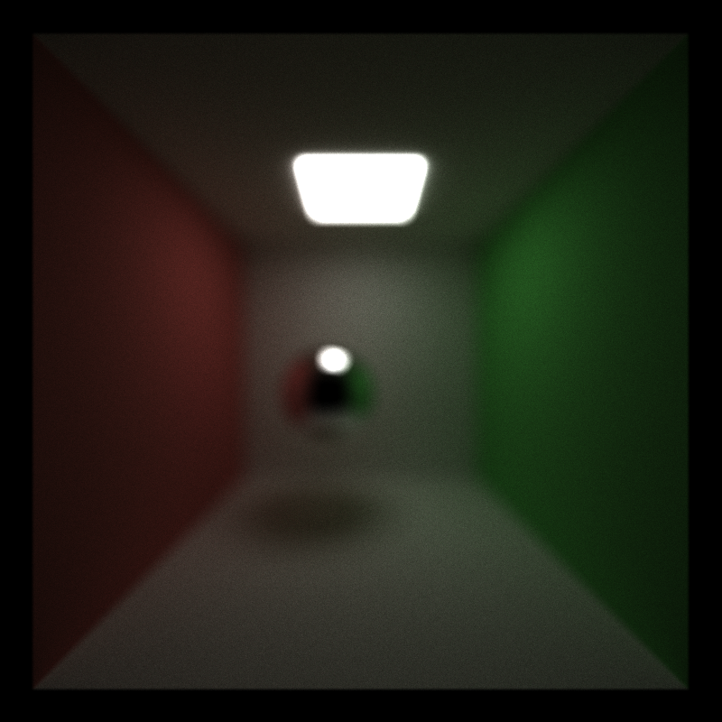
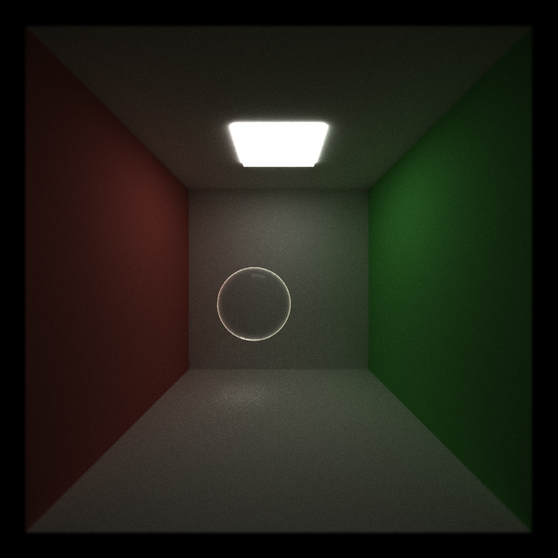
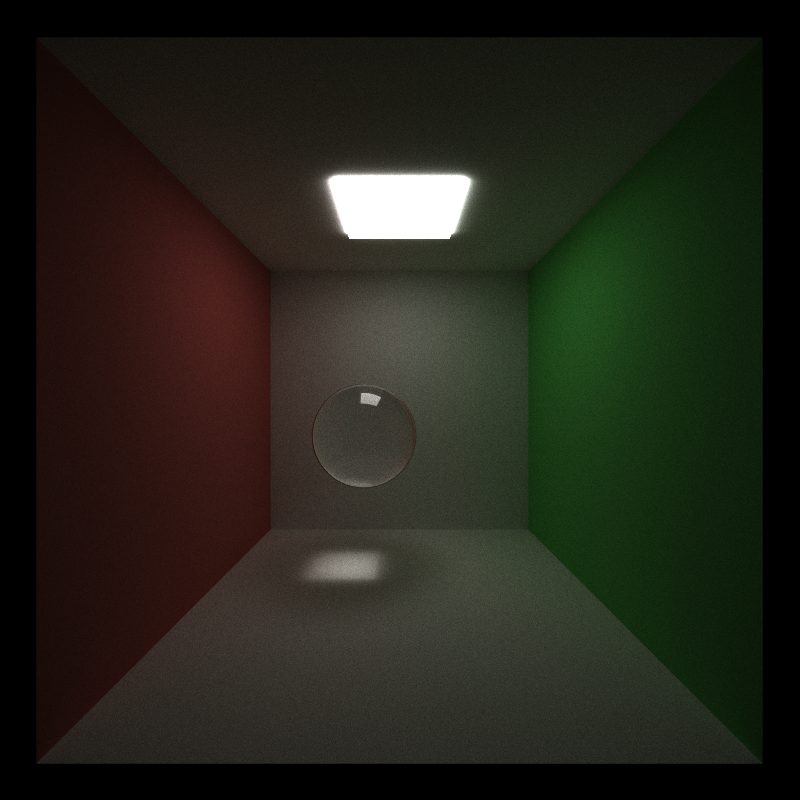
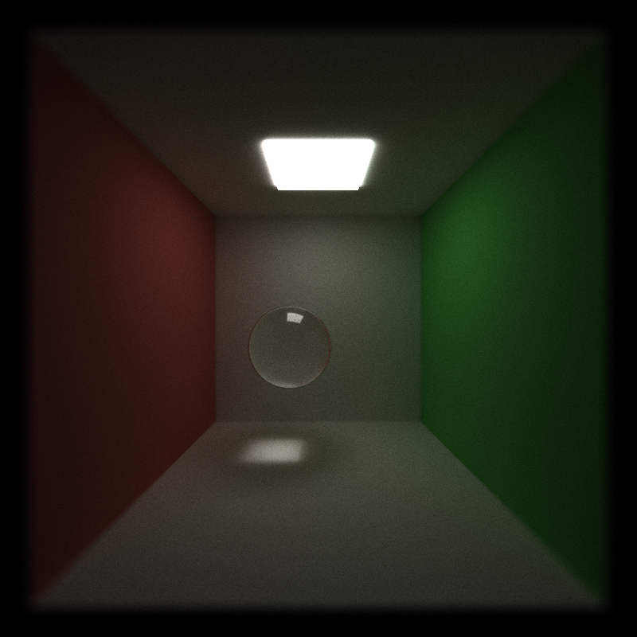
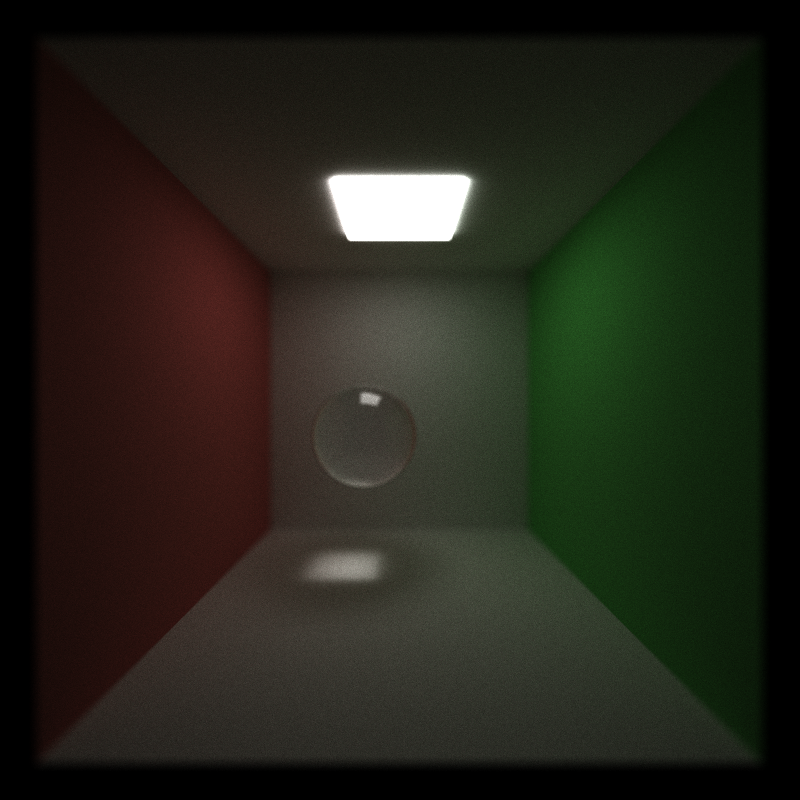

# CUDA Path Tracer

**University of Pennsylvania, CIS 565: GPU Programming and Architecture, Project 3**

* Christopher Yuen
  * [LinkedIn](https://www.linkedin.com/in/christopher-yuen-16b5a8221/)
* Tested on: Windows 11, 14th Gen Intel(R) Core(TM) i9-14900HX @ 2.22GHz 32GB, RTX 4090 Laptop GPU 16GB (Personal Laptop)

## Final Renders
<p align="center">

</p>

*Final showcase rendered at 1200 x 900 resolution for 900 iterations with a max path depth of 6. Camera aperture of 1.0 with focal distance of 218*

<p align="center">

</p>

*Final showcase rendered at 1000 x 800 resolution for 612 iterations with a max path depth of 6. Camera aperture of 0.15 with focal distance of 29*


## Overview
This is a CUDA path tracer that renders globally-illuminated scenes on the GPU. Rays are fired from a virtual camera, scattered off surfaces according to their BSDF, and accumulated over many iterations to converge on a noise-free image. The renderer pipeline is as follows: ray generation, intersection, shading, stream compaction, and final gather. Rendered results are averaged across iterations. 

Rendering is iterative with each frame producing one sample per pixel. The renderer supports arbitrary OBJ meshes, acceleration structures for cheap ray-scene intersection, dielectric materials with Fresnel, and a thin-lens camera.

## Pipeline
The renderer is structured as a per-bounce pipeline:
1. **Ray generation:**  one camera ray per pixel, jittered within the pixel for antialiasing along with optional redirection through a thin lens for depth of field.
2. **Intersection:** each active ray tested against analytic primitives (spheres, cubes) and against one or more imported triangle meshes via BVH traversal.
3. **Shading & scattering:** the hit material evaluates its BSDF, the path throughput is updated, and a new ray is produced for the next bounce.
4. **Stream compaction:** terminated and escaped paths are removed from the active path array so later passes operate on smaller working set.
5. **Final gather:** paths that reach an emissive surface contribute their accumulated throughput to the framebuffer.

## Core Features
### <ins>Diffuse BSDF</ins>
Diffuse surfaces use cosine-weighted hemisphere sampling. For a Lambertian BRDF `f = albedo / π` and a cosine-weighted PDF `p(ω) = cos θ / π`, the Monte Carlo weight simplifies to: `weight = f · cos θ / p(ω) = albedo`. The throughput multiplier for a diffuse bounce is therefore just the material's albedo, and the outgoing ray direction is drawn from a cosine-weighted hemisphere around the surface normal. New ray origins are offset along the normal by `1e-3` to avoid self-intersection. 

<p align="center">

</p>

### <ins>Specular BSDF</ins>
Specular surfaces reflect the incoming ray about the surface normal. The throughput is tinted by the material's specular color. Diffuse and specular are treated as disjoint material types (based on the `hasReflective` flag) which avoids the cost of a two-branch Monte Carlo estimator for pure-mirror surfaces.

<p align="center">

</p>

### <ins>Material-Coherent Ray Reordering</ins>
After intersection, path segments are sorted by material ID before shading. This groups rays hitting the same material contiguously in memory so that warps are more likely to execute the same shading branch. The sort is implemented via `thrust::sort_by_key` on a zipped iterator of `(PathSegment, ShadeableIntersection)` pairs, keyed on material ID. This feature is toggleable via `#define SORT_BY_MATERIAL`.

### <ins>Stream Compaction</ins>
Every bounce, rays that have escaped the scene or exhausted their bounce budget are removed from the active path array:
```cpp
PathSegment* dev_active_end = thrust::stable_partition(
    thrust::device, dev_paths, dev_paths + num_paths, PathIsActive());
num_paths = dev_active_end - dev_paths;
```
This keeps subsequent intersection and shading kernels sized to the actual workload rather than the full pixel count. 

### <ins>Stochastic Sampled Antialiasing</ins>
Each camera ray is jittered within its pixel by a uniform random offset in `[-0.5, 0.5]` before projection into view space:
```cpp
float jitterX = u01(rng) - 0.5f;
float jitterY = u01(rng) - 0.5f;

glm::vec3 pinholeDir = glm::normalize(cam.view 
    - cam.right * cam.pixelLength.x * (((float)x + jitterX) - (float)cam.resolution.x * 0.5f) 
    - cam.up * cam.pixelLength.y * (((float)y + jitterY) - (float)cam.resolution.y * 0.5f));
```
Because the RNG is seeded on the iteration number, each frame produces a different jitter pattern and thus the running average over many iterations converges to a smooth, aliasing-free image. Antialiasing costs no additional rays and only requires more iterations to converge.

### <ins>Radiance/Throughput Separation</ins>
A path's `color` field accumulates BSDF weights (throughput) at every bounce but only becomes a radiance contribution when the path actually reaches an emissive surface. I added a `hitLight` flag to `PathSegment` that `shadeMaterial` sets only when a path terminates on an emissive hit, and then `finalGather` adds a path to the framebuffer only if that flag is set:
```cpp
if (iterationPath.hitLight) {
    image[iterationPath.pixelIndex] += iterationPath.color;
}
```
Without this, paths that simply ran out of bounces would still contribute their accumulated throughput as if it were light, producing a subtle brightness bias that grows with bounce depth. 

## Extra Features 
### <ins>OBJ Mesh Loading</ins>

<p align="center">

</p>

The scene loader accepts arbitrary geometry imported from Wavefront OBJ files. Meshes are parsed with `tinyobjloader`, transformed into world space on the CPU, and flattened into a single contiguous triangle array for the GPU. The loader handles vertex positions, vertex normals, polygonal faces, and the common OBJ face-index forms (`v`, `v/vt`, `v//vn`, `v/vt/vn`). Polygonal faces are triangulated with a triangle fan. When vertex normals are missing, the loader falls back to the geometric face normal. Object transformations from the scene file are applied to the imported geometry before rendering. 

Ray-triangle intersection uses the Möller–Trumbore algorithm, which is self-contained and `__host__ __device__` compatible. Imported triangles participate in both intersection paths: 
1) **with BVH disabled:** rays test every mesh triangle directly
2) **with BVH enabled:** rays traverse CPU-built triangle BVH

**Bounding-Volume Culling:** Before descending into a mesh, the intersection kernel tests the ray against the mesh's overall AABB. If the ray misses it, all mesh triangles are skipped:
```cpp
#if BVH_BBOX_CULLING
    if (!bboxIntersectionTest(mesh.bboxMin, mesh.bboxMax, pathSegment.ray)) {
        continue;
    }
#endif
```

### <ins>Bounding Volume Hierarchy</ins>
The BVH accelerates ray-triangle intersection by rejecting groups of triangles whose bounding boxes do not intersect the ray. It is built once on the CPU when the scene is initialized and traversed iteratively on the GPU.

**CPU Construction:** For each mesh, I compute per-triangle centroid and recursively partition the triangle index list. At each internal node:
* Compute the node's AABB over the contained triangles
* If the count is ≤ 4 (or depth ≥ 64) we emit a leaf and record the triangle range
* Otherwise, split along the longest axis of the AABB at the median using `std::nth_element`
The tree is emitted as a flat array in BFS order, so every interior node's left child is at `leftFirst`, right child at `leftFirst + 1`, and every leaf node stores `(triStart, triCount)` into the reordered triangle array. Triangles are reordered at the end so that each leaf references a contiguous range.

**GPU Traversal:** uses a fixed-sized 64 entry stack:
```cpp
int stack[64];
int sp = 0;
stack[sp++] = 0;

while (sp > 0) {
    int nodeIdx = stack[--sp];
    const BVHNode& node = nodes[nodeIdx];

    if (!bboxIntersectionTest(node.bboxMin, node.bboxMax, r)) continue;

    if (node.triCount == 0) {
        stack[sp++] = node.leftFirst;
        stack[sp++] = node.leftFirst + 1;
    } else {
        for (int i = 0; i < node.triCount; i++) {
            // Möller–Trumbore triangle test
        }
    }
}
```

### <ins>Refraction and Fresnel</ins>

<p align="center">

</p>

Refractive materials use a dielectric model with Snell's law and Fresnel reflectance. During shading, I determine whether the ray is entering or exiting the material from the intersection's `outside` flag and pick the corresponding index-of-refraction ratio:
```cpp
float eta = outside ? (1.0f / ior) : ior;
glm::vec3 refracted = glm::refract(incident, normal, eta);
```
`glm::refract` returns a 0 vector when total internal reflection occurs, which I detect and handle by falling back to reflection. For non-TIR cases, I use Schlick's approximation to compute Fresnel reflectance:
```cpp
float cosTheta = glm::clamp(glm::dot(-incident, normal), 0.0f, 1.0f);
float F0 = (1.0f - ior) / (1.0f + ior);
F0 = F0 * F0;
float fresnel = F0 + (1.0f - F0) * powf(1.0f - cosTheta, 5.0f);
```
The reflected and refracted branches are chosen stochastically with probability `fresnel` and `1 - fresnel` respectively. Each branch's throughput is divided by the probability of taking it. This keeps the estimator unbiased but produces a well-known high-variance artifact of fireflies because the reflected branch can carry a larger multiplier when `fresnel` is close to 0.

**Firefly Suppression:** To bound the variance without breaking the estimator, the throughput multiplier is clamped to a maximum value. This introduces a small bias in the rare event tail, but the visual result is dramatically cleaner at low sample counts, and the bias decays as more samples accumulate. 

### <ins>Physically-Based Depth of Field</ins>

<p align="center">

</p>

The camera uses a thin-lens model. For each primary ray:
1. Compute the pinhole ray direction for the pixel, including the antialiasing jitter
2. Find where that ray intersects the focal plane (at distance `focalDistance` from the camera)
3. Sample a point on a disk of radius `aperture` perpendicular to the view direction with `r = aperture * sqrt(u01)` so the sample is uniformly distributed over the disk area
4. Move the ray origin to the sampled lens position and aim at the focal point

When `aperture = 0`, the pinhole behavior is recovered because the lens sample becomes the camera center. A second parameter `FOCAL_DISTANCE` controls which depth is in focus. Setting focal distance to a specific object's distance from the camera makes that object sharp and blurs everything else. 


## Performance Analysis
All measurements below are from the Release build on the RTX 4090 Laptop listed at the top of this README, with `ERRORCHECK` set to `0` and V-Sync off. The measurements are application-level (`ms/frame` from the ImGui overlay).

### <ins>Stream Compaction</ins>
After each bounce, terminated paths are removed from the active array. To show what this means for the working set, I recorded the active path count immediately after compaction at each bounce. I compared the provided open Cornell scene against a closed Cornell scene, which adds a front wall that seals the box and forces escaping rays to continue bouncing.
| Bounce | Open Cornell | Open (% of Pixels) | Closed Cornell | Closed (% of Pixels) |
| --- | --- | --- | --- | --- |
| 1 | 522,860 | 81.7% | 632,854 | 98.9% |
| 2 | 363,121 | 56.7% | 624,962 | 97.7% |
| 3 | 285,425 | 44.6% | 619,108 | 96.7% |
| 4 | 231,876 | 36.2% | 613,932 | 95.9% |
| 5 | 189,964 | 29.7% | 609,280 | 95.2% |
| 6 | 155,490 | 24.3% | 605,147 | 94.6% |
| 7 | 127,613 | 19.9% | 601,519 | 94.0% |
| 8 | 0 | 0% | 0 | 0% |


The active path count drops much more quickly in the open scene. By bounce 7, only 19.9% of the original primary rays are still active in the open Cornell box, while 94.0% are still active in the closed version. The open scene allows rays to escape through the camera-side opening, so paths terminate after a small number of bounces. The closed scene adds a front wall that seals the box, forcing nearly every ray to keep bouncing until it hits the light or exhausts its bounce budget. Stream compaction is therefore most beneficial in scenes where paths terminate early.

### <ins>Material Sorting</ins>
| SORT_BY_MATERIAL | Frame Time | FPS | Comparison |  
| --- | --- | --- | --- |
| 0 (OFF) | 18.622 ms | 53.7 | baseline |
| 1 (ON) | 42.373 ms | 23.6 | 2.28x slower |


Enabling material sorting more than doubled the frame time on the Cornell box. The scene only has a handful of distinct materials (diffuse red, diffuse green, diffuse white, specular, refractive, emitting) and thus the shading kernel is inexpensive and warp-level divergence is low. The `thrust::sort_by_key` call, launched once per bounce over the active path array, dominates the frame budget with the sort running 8 times per frame. Thus the result is scene-dependent. For example, a scene with dozens of materials and more expensive per-material BSDF evaluation (or with refraction and texture lookups creating large divergent branches), the coherence gain would grow and the sort cost would be covered given more per-ray work.

### <ins>Mesh Loading</ins>
#### **GPU vs hypothetical CPU Comparison:** 
The loader itself runs on the CPU (parsing with `tinyobjloader`, transforming vertices, building the triangle array) so the loading phase is already CPU-bound and would be essentially identical on a pure-CPU renderer. The GPU-accelerated part is the intersection phase, where the flattened triangle array is queried once per ray per bounce. On the GPU, this is a massively parallel operation that scales with the number of resident rays. On the CPU, the same triangle tests would run sequentially or across a limited number of threads and the loader's upfront cost would be relatively more significant.

#### **Further Optimization:** 
The loader currently loads every triangle from every mesh into one flat array. For scenes with many meshes this is fine, but for scenes with many frames (or reloading), caching the parsed geometry between runs would save the parse time. On the intersection side, the loader assumes every triangle is tested with the Möller–Trumbore algorithm. A more efficient path for regular grids or heightfields (common in scanned meshes) would be to store the mesh as a texture and use texture-fetch-based intersection, which the GPU's texture units accelerate. 

### <ins>BVH Traversal</ins>
| Scene | BVH OFF | BVH ON | Speedup |
| --- | --- | --- | --- | 
| Cornell box (few primitives) | 18.315 ms | 18.975 ms | 0.97x slower |
| Mesh showcase (366,104 triangles) | 2,178.863 ms | 1,225.253 ms | 1.78x faster |


The Cornell box result reflects the expected tradeoff at small primitive counts. With only a handful of primitives, the per-ray work saved by hierarchical culling is smaller than the cost of AABB tests, stack pushes, and additional memory traffic from BVH node reads. The mesh showcase thus shows the opposite. With 366,104 triangles across 5 meshes and a BVH containing 216,741 nodes, the naive path tests every triangle per ray per bounce, the BVH rejects entire subtrees whose AABBs the ray misses. This result showed a 1.78x speedup, confirming that the hierarchical culling does reduce the primitive-intersection work when there is enough geometry to cull. 

#### **GPU vs hypothetical CPU Comparison:** 
The BVH is an example of an algorithm whose benefit is CPU/GPU invariant: hierarchical culling reduces the number of primitive intersection tests regardless of the underlying processor. On the GPU, traversal uses a per-thread stack, which is divergent across warps (each thread's stack has different contents) and requires careful handling to avoid serialization. On a CPU, the same traversal is a straightforward recursive or iterative loop with no SIMT constraints. The GPU-specific costs are the per-thread stack memory and the warp-divergent node visits; the CPU-specific costs are the overhead of function calls and pointer chasing through the tree. Both platforms benefit when scene complexity is high enough to justify the traversal overhead.

#### **Further Optimization:** 
The current build uses median split on the longest axis of the node AABB, which is simple and fast to construct but produces trees that are less traversal-efficient than a surface-area-heuristic (SAH) build. Switching to SAH would reduce the number of nodes visited per ray by roughly 20–30% on typical meshes. On the traversal side, the current implementation pushes both children unconditionally — the "test-before-push" optimization tests each child's AABB against the ray before pushing, which reduces stack traffic. Sorting traversal order so the closer child is popped first allows early termination once a closer hit is found.

### <ins>Refraction and Fresnel</ins>
| IOR = 1.0 (control) | IOR = 1.5 (glass) |
| --- | --- | 
|  |  |

At IOR 1.0, the sphere is optically matched with the surrounding medium and so transmitted rays pass through without bending and the sphere becomes nearly invisible (only a faint Fresnel silhouette remains). At IOR 1.5, the sphere bends light like window glass and the Fresnel reflectance brightens the silhouette at grazing angles. The Fresnel branch does add work to the shading kernels:
* `eta` selection based on entering/exiting flag
* `glm::refract` call
* total-internal-reflection check
* Schlick Fresnel evaluation with one `powf`
* stochastic branch
Relative to the diffuse and specular paths, this is more computation per hit. However, in the Cornell box, the glass sphere occupies a small fraction of the image, so the aggregate effect on frame time is small. The performance effect that is visible is on convergence. The stochastic Fresnel branch and the `1/p` throughput division introduce high variance at low sample counts, which is why the iterative preview window shows fireflies until the accumulated sample count is large enough to average them out. 

#### **GPU vs hypothetical CPU Comparison:** 
A CPU implementation would perform exactly the same Snell's-law refraction, TIR check, Schlick Fresnel evaluation, and stochastic branch selection. The differences are in execution, not algorithm. On the GPU, adjacent paths in a warp can take the reflect and refract branches independently, producing SIMT divergence where the two branches must be serialized. On the CPU, the same divergence becomes a branch-prediction event, which is comparatively cheap when predictable and expensive when not. The GPU's advantage is processing a large number of per-ray decisions concurrently, which is what the rest of the pipeline already exploits.

#### **Further Optimization:** 
The most impactful improvements target variance. Russian roulette on throughput would probabilistically terminate low-contribution paths and eliminate much of the firefly noise. Clamping the Fresnel branch probability to a minimum (i.e., `max(fresnel, 0.1)`) bounds the worst-case throughput multiplier at `1/0.1 = 10x` rather than `1/F0 = 25x` at near-normal incidence, without much bias. Direct lighting / next-event estimation would eliminate the fireflies entirely by sampling the light explicitly at each bounce. For realism rather than speed, splitting the IOR into per-channel values would produce chromatic dispersion (rainbow-like refraction) at essentially no additional cost.

### <ins>Depth of Field</ins> 
| Pinhole (`APERTURE = 0.0`) | Thin lens (`APERTURE = 0.3`, `FOCAL_DISTANCE = 12.0`) | 
| --- | --- | 
|  | 

| `FOCAL_DISTANCE = 12.0` | `FOCAL_DISTANCE = 9.0` | 
| --- | --- | 
|  | 

When the aperture is greater than 0, the ray-generation kernel performs additional work per pixel:
* `sqrt()`
* `sincos` equivalent pair for the disk sample
* 2 multiplies (for lens offset)
* 1 subtraction
* normalization (for new ray direction)
This cost is negligible as it is a fixed number of floating-point operations per primary ray, before any scene traversal takes place. When the aperture is 0, the lens calculation is skipped entirely. The performance effect is again on convergence. Each iteration now samples a different point on the lens for each pixel, which increases the variance of the primary-ray estimate for any pixel that is out of focus. Reducing that variance requires more samples than the pinhole render at the same noise threshold. In practice, a scene with a large aperture will need 2-4x as many iterations as a pinhole render of the same scene to reach comparable resolution of the blurred regions. 

#### **GPU vs hypothetical CPU Comparison:** 
The thin-lens camera model is entirely per-pixel and parallel, every primary ray is independent of every other. This is true on both the CPU and the GPU; the difference is throughput. A modern GPU generates primary rays for a million pixels in the time a CPU generates rays for tens of thousands. On a CPU, the same camera model would produce identical images at the same arithmetic cost, just with lower ray throughput. There is no algorithmic difference between the two implementations, only an execution-scale difference.

#### **Further Optimization:** 
The primary-ray generation kernel is already very cheap, so the meaningful optimizations target the variance introduced by lens sampling. Replacing the uniform random disk sample with a low-discrepancy sequence (Halton or Sobol) indexed by `(pixelIndex, iteration)` would reduce the variance of the depth-of-field estimate for a fixed sample budget. Placing the camera basis vectors in `__constant__` memory would broadcast them to a warp in a single cycle, though the current kernel argument passing is already efficient. If the renderer were extended to support multiple primary rays per pixel, the focal-plane computation could be shared across sub-pixel samples.

## Build and Run
The project is built with CMake and Visual Studio 2022 on Windows 11. 

**Prerequisites:**
* CUDA toolkit (v13.3)
* Visual Studio 2022 with CUDA workload
* `tiny_obj_loader.h` in `external/include`

**Run:** 
```
.\build\bin\Release\cis565_path_tracer.exe .\scenes\cornell.json
```

**Controls:**
* `ESC` — save & exit
* `S` — save image
* `Space` — re-center camera to original lookAt point
* Left mouse — orbit camera
* Right mouse — zoom
* Middle mouse — pan lookAt point in X/Z plane

**Object Transforms:** Imported meshes use the same `TRANS` / `ROTAT` / `SCALE` block as primitives:
```
"TYPE": "mesh",
"MATERIAL": "specular_white",
"FILE": "../scenes/mesh.obj",
"TRANS": [0.0, 4.0, 0.0],
"ROTAT": [90.0, 180.0, 0.0],
"SCALE": [0.5, 0.5, 0.5]
```

**Camera Extensions:** camera block accepts 2 new fields `APERTURE` and `FOCAL_DISTANCE`
```
"Camera": {
    ...
    "APERTURE": 0.1,
    "FOCAL_DISTANCE": 10.5
}
```
`APERTURE` defaults to `0.0` (pinhole) & `FOCAL_DISTANCE` defaults to `length(lookAt - position)`

**Refractive Materials:** `Refractive` material type with `IOR` field
```
"glass": {
    "TYPE": "Refractive",
    "RGB": [1.0, 1.0, 1.0],
    "IOR": 1.5
}
```

## Third-Party Assets
* `tiny_obj_loader.h` — single-header [Wavefront OBJ parser](https://github.com/tinyobjloader/tinyobjloader)

The following 3D models were used for educational, non-commercial purposes in this project:
*   Cup — [free3d.com/3d-model/cup-933734.html](https://free3d.com/3d-model/cup-933734.html)
*   Xbox One Controller — [free3d.com/3d-model/xbox-one-controller-295065.html](https://free3d.com/3d-model/xbox-one-controller-295065.html)
*   Desk Table — [free3d.com/3d-model/desk-table-184801.html](https://free3d.com/3d-model/desk-table-184801.html)
*   iPhone X — [free3d.com/3d-model/iphonex-113534.html](https://free3d.com/3d-model/iphonex-113534.html)
*   Modern Chair — [free3d.com/3d-model/modern-chair-11-82258.html](https://free3d.com/3d-model/modern-chair-11-82258.html)
*   Notebook (Low Poly) — [free3d.com/3d-model/notebook-low-poly-version-57341.html](https://free3d.com/3d-model/notebook-low-poly-version-57341.html)
*   Razer Kraken V2 Headphones — [free3d.com/3d-model/razer-kraken-v2-headphones-219.html](https://free3d.com/3d-model/razer-kraken-v2-headphones-219.html)
*   Computer Mouse V3 — [free3d.com/3d-model/computer-mouse-v3--595560.html](https://free3d.com/3d-model/computer-mouse-v3--595560.html)
