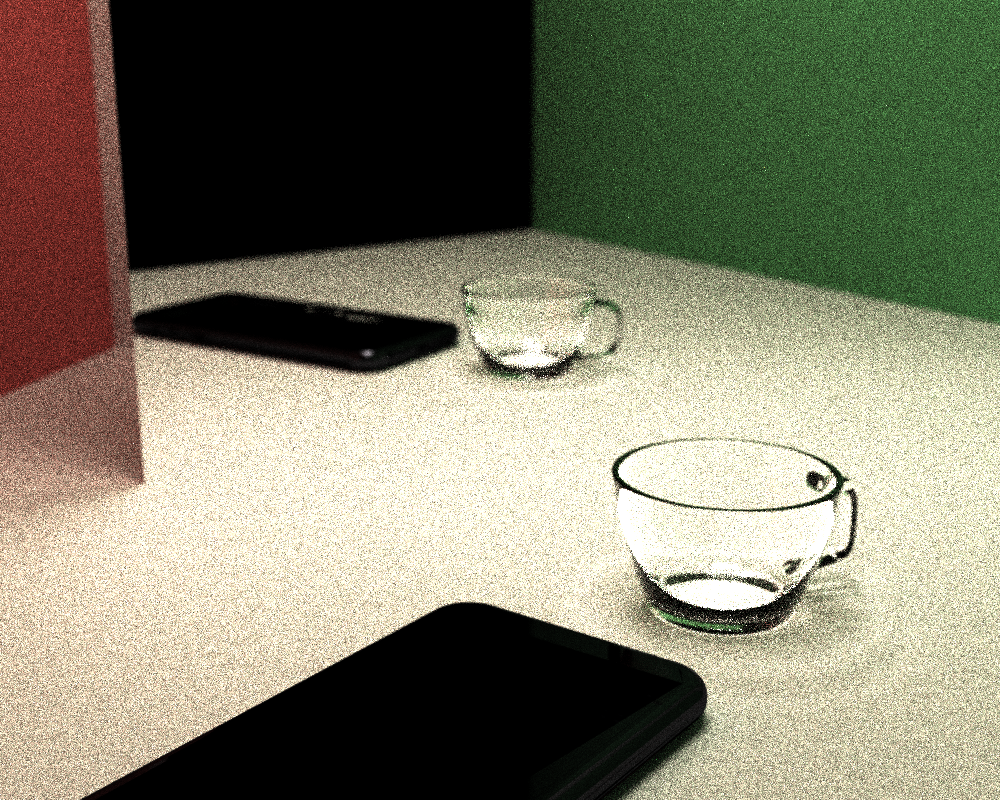

# CUDA Path Tracer

**University of Pennsylvania, CIS 565: GPU Programming and Architecture, Project 3**

* Christopher Yuen
  * [LinkedIn](https://www.linkedin.com/in/christopher-yuen-16b5a8221/)
* Tested on: Windows 11, 14th Gen Intel(R) Core(TM) i9-14900HX @ 2.22GHz 32GB, RTX 4090 Laptop GPU 16GB (Personal Laptop)

## Final Renders
<p align="center">

</p>

*Final showcase rendered at 1200 x 900 resolution for 900 iterations with a max path depth of 6. Camera aperture of 1.0 with focal distance of 218*

<p align="center">

</p>

*Final showcase rendered at 1000 x 800 resolution for 231 iterations with a max path depth of 6. Camera aperture of 0.15 with focal distance of 29*


## Overview
This is a CUDA path tracer that renders globally-illuminated scenes on the GPU. Rays are fired from a virtual camera, scattered off surfaces according to their BSDF, and accumulated over many iterations to converge on a noise-free image. The renderer pipeline is as follows: ray generation, intersection, shading, stream compaction, and final gather. Rendered results are averaged across iterations. 

Rendering is iterative with each frame producing one sample per pixel. The renderer supports arbitrary OBJ meshes, acceleration structures for cheap ray-scene intersection, dielectric materials with Fresnel, and a thin-lens camera.

## Outline
The rendered is structured as a per-bounce pipeline:
1. **Ray generation:**  one camera ray per pixel, jittered within the pixel for antialiasing along with optional redirection through a thin lens for depth of field.
2. **Intersection:** each active ray tested against analytic primitives (spheres, cubs) and against one or more imported triangle meshes via BVH traversal.
3. **Shading & scattering:** the hit material evaluates its BSDF, the path throughput is updated, and a new ray is produced for the next bounce.
4. **Stream compaction:** terminated and escaped paths are removed from the active path array so later passes operate on smaller working set.
5. **Final gather:** paths that reach an emissive surface contribute their accumulated throughput to the framebuffer.

## Core Features
### <ins>Diffuse BSDF</ins>
Diffuse surfaces sue cosine-weighted hemisphere sampling. For a Lambertian BRDF `f = albedo \ π` and a cosine-weighted PDF `p(ω) = cos θ / π`, the Monte Carlo weight simplifies to: `weight = f · cos θ / p(ω) = albedo`. The throughput multiplier for a diffuse bounce is therfore just the material's albedo, and the outgoing ray direction is drawn from a cosine-weighted hemisphere around the surface normal. New ray origins are offset along the normal by `1e-3` to avoid self-intersection. 

<p align="center">

</p>

### <ins>Specular BSDF</ins>
Specular surfaces reflect the incoming ray about the surface normal. The throughput is tinted by the material's specular color. Diffuse and specular are treated as disjoin material types (based on the `hasReflective` flag) which avoids the cost of a two-branch Monte Carlo estimator for pure-mirror surfaces.

<p align="center">

</p>

### <ins>Material-Coherent Ray Reordering</ins>
After intersection, path segments are sorted by material ID before shading. This groups rays hitting the same material contiguously in memory so that warps are more likely to execute the same shading branch. The sort is implemented via `thrust::sort_by_key` on a zipped iterator of `(PathSegment, ShadeableIntersection)` pairs, keyed on material ID. This feature is toggleable via `#define SORT_BY_MATEIRAL`.

### <ins>Stream Compaction</ins>
Every bounce, rays that have escaped the scene or exhausted their bounce budget are removed from the active path array:
```cpp
PathSegment* dev_active_end = thrust::stable_partition(
    thrust::device, dev_paths, dev_paths + num_paths, PathIsActive());
num_paths = dev_active_end - dev_paths;
```
This keeps subsequent intersection and shading kernels sized to the actual workload rather than the full pixel count. 

### <ins>Stochastic Sampled Antialiasing</ins>
Each camera ray is jittered within its pixel by a uniform random offset in `[-0.5, 0.5]` before projection into view space:
```cpp
float jitterX = u01(rng) - 0.5f;
float jitterY = u01(rng) - 0.5f;

glm::vec3 pinholeDir = glm::normalize(cam.view 
    - cam.right * cam.pixelLength.x * (((float)x + jitterX) - (float)cam.resolution.x * 0.5f) 
    - cam.up * cam.pixelLength.y * (((float)y + jitterY) - (float)cam.resolution.y * 0.5f));
```
Because the RNG is seeded on the iteration number, each frame produces a different jitter pattern and thus the running average over many iterations converges to a smooth, aliasing-free image. Antialiasing cost no additional rays and only requires more iterations to converge.

### <ins>Radiance/Throughput Separation</ins>
A path's `color` field accumulates BSDF weights (throughput) at every bounce but only becomes a radiance contribution when the path actually reaches an emissive surface. i added a `hitLight` flag to `PathSegment` that `shadeMaterial` sets only when a path terminates on an emissive hit, and then `finalGather` adds a path to the framebuffer only if that flag is set:
```cpp
if (iterationPath.hitLight) {
    image[iterationPath.pixelIndex] += iterationPath.color;
}
```
Without this, paths that simply ran out of bounces would still contribute their accumulated throughput as if it were light, producing a subtle brightness bias that grows with bounce depth. 

## Specific Features 
### <ins>OBJ Mesh Loading</ins>

<p align="center">

</p>

The scene loader accepts arbitrary geomtry imported from Wavefront OBJ files. Meshes are parsed with `tinyobjloader`, transformed into world space on the CPU, and flattened into a single contiguous triangle array for the GPU. The loader handles vertex positions, vertex normals, polygonal faces, and the common OBJ face-index forms (`v`, `v/vt`, `v//vn`, `v/vtvn`). Polygonal faces are triangulated with a triangle fan. When vertex normals are missing, the loaders falls back to the geometric face normal. Object transformations from the scene file are applied to the imported geometry before rendering. 

Ray-triangle intersection uses the Möller–Trumbore algorithm, which is self-contained and `__host__ __device__` compatible. Imported triangles participate in both intersection paths: 
1) **with BVH disabled:** rays test every mesh triangle directly
2) **with BVH enabled:** rays traverse CPU-built triangle BVH

**Bounding-Volume Culling:** Before descending into a mesh, the intersection kernel tests the ray against the mesh's overall AABB. If the ray misses it, all mesh triangles are skipped:
```cpp
#if BVH_BBOX_CULLING
    if (!bboxIntersectionTest(mesh.bboxMin, mesh.bboxMax, pathSegment.ray)) {
        continue;
    }
#endif
```

### <ins>Bounding Volume Hierarchy</ins>
The BVH accelerates ray-triangle intersection by rejecting groups of triangles whose bounding boxes do not intersect the ray. It is built once on the CPU when the scene is initialized and traversed iteratively on the GPU.

**CPU Construction:** For each mesh, I compute per-triangle centroid and recursively partition the triangle index list. At each internal node:
* Compute the node's AABB over the contained triangles
* If the count is ≤ 4 (or depth ≥ 64) we emit a leaf and record the triangle range
* Otherwise, split along the longest axis of the AABB at the median using `std::nth_element`
The tree is emitted as a flat array in BFS order, so every interior node's left child is at `leftFirst`, right child at `leftFirst + 1`, and every leaf node stores `(triStart, triCount)` into the reordered triangle array. Triangles are reordered at the end so that each leaf references a contiguous range.

**GPU Traversal:** uses a fixed-sized 64 entry stack:
```cpp
int stack[64];
int sp = 0;
stack[sp++] = 0;

while (sp > 0) {
    int nodeIdx = stack[--sp];
    const BVHNode& node = nodes[nodeIdx];

    if (!bboxIntersectionTest(node.bboxMin, node.bboxMax, r)) continue;

    if (node.triCount == 0) {
        stack[sp++] = node.leftFirst;
        stack[sp++] = node.leftFirst + 1;
    } else {
        for (int i = 0; i < node.triCount; i++) {
            // Möller–Trumbore triangle test
        }
    }
}
```

### <ins>Refraction and Fresnel</ins>

<p align="center">

</p>

Refractive materials use a dielectric model with Snell's law and Fresnel reflectance. During shading, I determine whether the ray is entering or exiting the material from the intersection's `outside` flag and pick the corresponding index-of-refraction ratio:
```cpp
float eta = outside ? (1.0f / ior) : ior;
glm::vec3 refracted = glm::refract(incident, normal, eta);
```
`glm::refract` returns a 0 vector when total internal reflection occurs, which I detect and handle by falling back to reflection. For non-TIR cases, I use Schlick's approximation to compute Fresnel reflectance:
```cpp
float cosTheta = glm::clamp(glm::dot(-incident, normal), 0.0f, 1.0f);
float F0 = (1.0f - ior) / (1.0f + ior);
F0 = F0 * F0;
float fresnel = F0 + (1.0f - F0) * powf(1.0f - cosTheta, 5.0f);
```
The reflected and refracted branches are chosen stochastically with probability `fresnel` and `1 - fresnel` respectively. Each branch's throughput is divided by the probability of taking it. This keeps the estimator unbiased but produces a well-known high-variance artifact of fireflies because the reflected branch can carry a larger multiplier when `fresnel` is close to 0.

**Firefly Suppression:** To bound the variance without breaking the estimator, the throughput multiplier is clamped to a maximum value. This introduces a small bias in the rar-even tail, but the visual result is dramatically cleaner at low sample counts, and the bias decays as more samples accumulate. 

### <ins>Physically-Based Depth of Field</ins>

<p align="center">

</p>

The camera uses a thin-lens model. For each primary ray:
1. Compute the pinhole ray direction for the pixel, including the antialiasing jitter
2. Find where that ray intersects the focal plane (at distance `focalDistance` from the camera)
3. Sample a point on a disk of radius `aperture` perpendicular to the view direction with `r = aperture * sqrt(u01)` so the sample is uniformly distributed over the disk area
4. Move the ray origin to the sample lens position and aim at the focal point

When `aperture = 0`, the pinhole behavior is recovered because the lens sample becomes the camera center. A second parameter `FOCAL_DISTANCE` controls which depth is in focus. Setting focal distance to a specific object's distance from the camera makes that object sharp and blurs everything else. 

## Performance Analysis
All measurements below are from the Release build on the RTX 4090 Laptop listed at the top of this README, with `ERRORCHECK` set to `0` and V-Sync off. The measurements are application-level (`ms/frame` from the ImGui overlay).

### <ins>Stream Compaction</ins>

### <ins>Material Sorting</ins>

### <ins>BVH Traversal</ins>

### <ins>Refraction and Fresnel</ins>

### <ins>Depth of Field</ins> 

## Build and Run
The project is built with CMake and Visual Studio 2022 on Windows 11. 

**Prerequisites:**
* CUDA toolkit (v13.3)
* Visual Studio 2022 with CUDA workload
* `tiny_obj_loader.h` in `external/include`

**Run:** 
```
.\build\bin\Release\cis565_path_tracer.exe .\scenes\cornell.json
```

**Controls:**
* `ESC` — save & exit
* `S` — save image
* `Space` — re-center camera to original lookAt point
* Left mouse — orbit camera
* Right mouse — zoom
* Middle mouse — pan lookAt point in X/Z plane

**Object Transforms:** Imported meshes use the same `TRANS` / `ROTAT` / `SCALE` block as primitives:
```
"TYPE": "mesh",
"MATERIAL": "specular_white",
"FILE": "../scenes/mesh.obj",
"TRANS": [0.0, 4.0, 0.0],
"ROTAT": [90.0, 180.0, 0.0],
"SCALE": [0.5, 0.5, 0.5]
```

**Camera Extensions:** camera block accepts 2 new fields `APERTURE` and `FOCAL_DISTANCE`
```
"Camera": {
    ...
    "APERTURE": 0.1,
    "FOCAL_DISTANCE": 10.5
}
```
`APERTURE` defaults to `0.0` (pinhole) & `FOCAL_DISTANCE` defaults to `length(lookAt - position)`

**Refractive Materials:** `Refractive` material type with `IOR` field
```
"glass": {
    "TYPE": "Refractive",
    "RGB": [1.0, 1.0, 1.0],
    "IOR": 1.5
}
```

## Third-Party Assets
* `tiny_obj_loader.h` — single-header [Wavefront OBJ parser](https://github.com/tinyobjloader/tinyobjloader)

